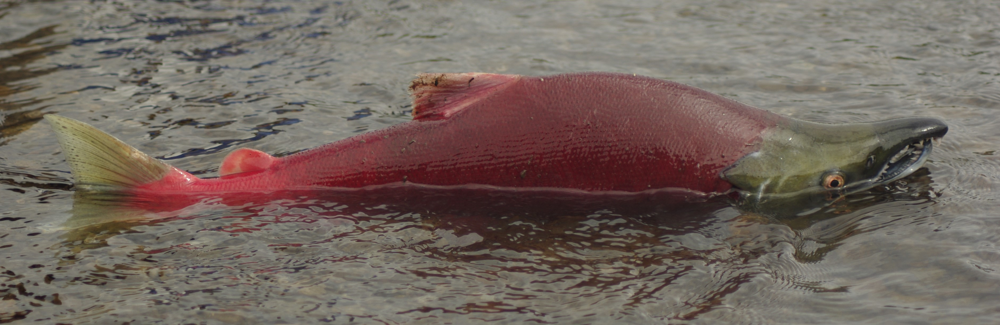

{fig-alt="salmon"}

## Introduction

Pacific salmon systems are characterized by a complex life-history with drivers that influence them at various life stages in both the marine and freshwater environments.
We can address those changes through Harvest, Hatchery and Habitat management, but there is often little guidance on how these relatively coarse scale levers can help achieve management objectives given the underlying complexity in life-history and environmental drivers.

salmonMSE is an open-source tool designed for fishery and hatchery managers, scientists, and other interested stakeholders to evaluate and compare strategic trade-offs among these three management levers.

salmonMSE utilizes a risk-based approach for prioritizing management levers to identify trade-offs in achieving biological and harvest objectives among management levers for medium-to-long term strategic planning.

## salmonMSE development

Development of salmonMSE is informed by a Technical Advisory Group (TAG) that provides advice on model structure and conditioning, model outputs, ease of use, and future application to the West Coast Vancouver Island (WCVI) Chinook case study.

In 2024, participants in the TAG consists of DFO and First Nations, including SEP, WCVI Area Stock assessment, DFO core Science, SARA, and PSSI.
If the prototype is successful, a broader TAG will be created in future phases of the project to guide the development and application of the tool more generally.

Presentations to the TAG are available below. 
Contents reflect information to the date of the presentation and may be currently out of date, as salmonMSE is currently under active development and is subject to additional modification based on feedback.

- [Presentation - January 29, 2024](https://docs.google.com/presentation/d/1PVvoBhJ5L8g5_PbffgvihrISDKZ5JxLY/edit?usp=sharing&ouid=110611304283721893731&rtpof=true&sd=true)
- [Presentation - October 30, 2024](https://docs.google.com/presentation/d/1lwvVfMDwYrwQ6Qjuato77hK4h_Mu6VeW/edit?usp=sharing&ouid=110611304283721893731&rtpof=true&sd=true)
- [Presentation - March 24, 2025](https://docs.google.com/presentation/d/1Vj8nYupT_3fHbCLnDlRwfMrJfjxPhY-c/edit?usp=sharing&ouid=110611304283721893731&rtpof=true&sd=true)
salmonMSE applications

## salmonMSE applications

### Sarita River Chinook Salmon

The Sarita River Chinook Salmon (*Oncorhynchus tshawytscha*) population is part of a broader West Coast Vancouver Island stock complex that is listed under Canada's *Fisheries Act* and is currently below its limit reference point. 
As part of the rebuilding requirements for this stock, population-specific rebuilding plans are being developed for individual rivers. 
The work described here contributes to the development of a rebuilding strategy for the Sarita River population.

The Sarita River is located within the territory of the Huu-ay-aht First Nations, a modern treaty Nation with self-governing authority in the Barkley Sound region on the west coast of Vancouver Island.

Sarita River Chinook Salmon are subject to multiple sources of management intervention through mixed-stock marine fisheries, terminal in-river fisheries, hatchery enhancement, and habitat restoration initiatives. 
salmonMSE was used to evaluate alternative harvest and hatchery management strategies for rebuilding the population under uncertainty regarding the effects of habitat conditions on population dynamics. 

The model outputs were developed to support fisheries management and rebuilding decision-making by the Huu-ay-aht First Nations:

- [Presentation - Feburary 2, 2026](https://docs.google.com/presentation/d/17gjZdGj7l0s94G3m_Iklbe6CF6hvUdZ-/edit?usp=sharing&ouid=110611304283721893731&rtpof=true&sd=true)

### Upper Strait of Georgia Chinook Salmon

**Ongoing as of October 2026**

Upper Strait of Georgia Chinook Salmon are also listed under Canada's *Fisheries Act*, requiring an assessment of stock status and rebuilding needs. 
As part of this assessment, salmonMSE is being used to evaluate the effects of alternative marine and terminal fishery harvest levels and hatchery production scenarios on management objectives.

This stock complex includes both hatchery-dominated systems, such as the Quinsam and Campbell Rivers, and predominantly natural-origin systems, including the Nimpkish, Salmon, and Adam/Eve Rivers.
These populations differ in their management objectives, particularly with respect to harvest opportunities and the conservation of natural-origin production, as measured by metrics such as the Proportionate Natural Influence (PNI).

## Technical Training

Technical training on salmonMSE was delivered in April 2026 at the Pacific Biological Station, Nanaimo, BC.
Training materials include demonstrations of single operating-model simulations, as well as more comprehensive tutorials covering the evaluation of multiple candidate management strategies.
These materials guide users through model implementation, generation of performance metrics, and comparison of alternative management options.

Training materials are available on [GitHub](https://github.com/Blue-Matter/salmonMSE-course-2026)

Since the workshop, the training materials have been updated as tutorials as part of the salmonMSE [technical documentation](https://docs.salmonmse.com/articles/index.html).

## Technical Details

For technical details on running salmonMSE, see the [technical documentation](https://docs.salmonmse.com).

A Technical Report is in preparation as of October 2026.
